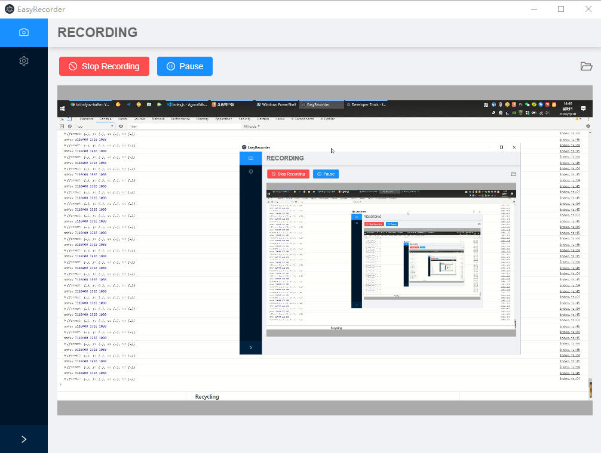
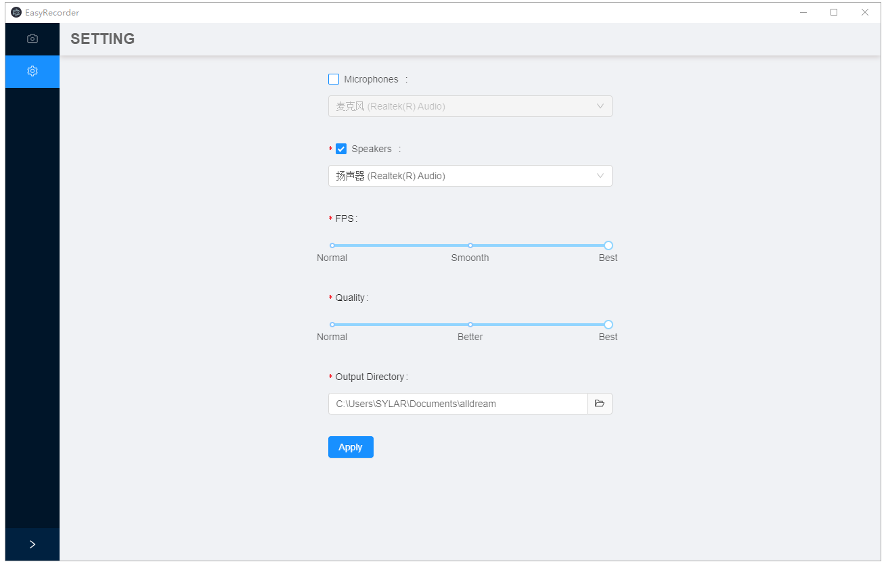

# ffmpeg-recorder

This is a node-js addon by screen-recorder which is written by c++ based on ffmpeg.

Only support windows(at least windows7 sp1) for now.


## Features

- Save screen、speaker、miccrophone to a signle file as mp4
- yuv data callback


## Usage


### 1.Add ffmpeg-recorder addon to your package.json

```sh
$ npm install ffmpeg-recorder

# or

$ yarn add ffmpeg-recorder
```

### 2.Add parameters to your package.json file

build electron version:

```json
"ffmpeg_recorder": {
    "electron_version": "7.1.4",
    "platform": "win32",
    "runtime":"electron",
    "msvs_version": "2015",
    "debug": false,
    "silent": false
  }
```

or build node version:

```json
"ffmpeg_recorder": {
    "platform": "win32",
    "runtime":"node",
    "msvs_version": "2015",
    "debug": false,
    "silent": false
  }
```


## Test code

```js

"use strict";
const EasyRecorder = require('./lib/index')


const recorder = new EasyRecorder();

const speakers = recorder.GetSpeakers();
const mics = recorder.GetMics();

console.log(speakers);
console.log(mics);

let ret = recorder.Init(60,20,".\\save.mp4",speakers[0].name,speakers[0].id,mics[0].name,mics[0].id);
console.info('recorder init ret:',ret);


if(ret == 0){

  ret = recorder.Start();
  console.info('start',ret);

  setTimeout(()=>{

    recorder.Stop();
    recorder.Release();
  },10000);
}

```

## Enable preview

``` js

recorder.EnablePreview(true);
recorder.SetPreviewElement(document.getElementById("dom-id"));

```

## Disable preview

``` js

recorder.EnablePreview(false);

```

## EasyRecorder UI Project

https://github.com/peilinok/EasyRecorder



